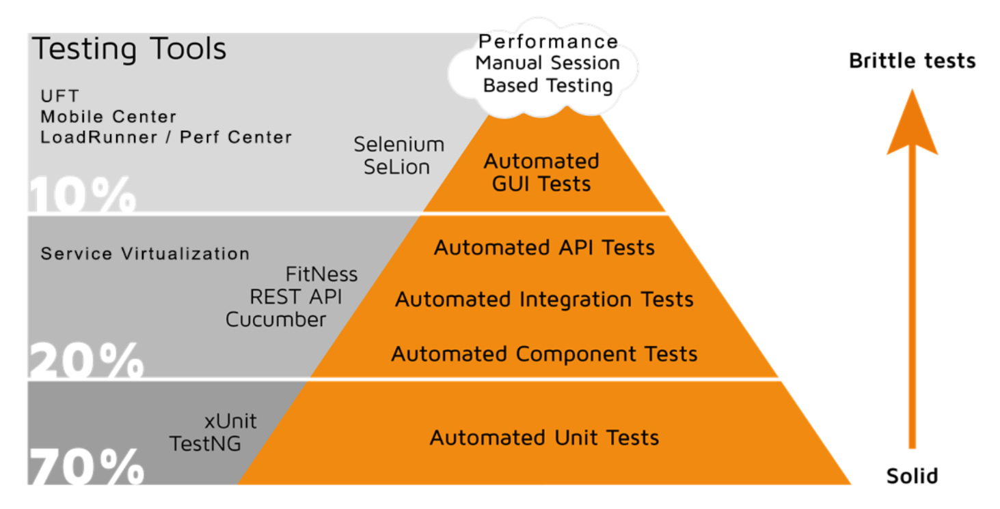

 

> Let's start to work on the improvement theme on continuous testing, which has been added to the team agile backlog: [https://github.dxc.com/[your_username]/pet-clinic/issues](https://[[HOST_SUBDOMAIN]]-9876-[[KATACODA_HOST]].environments.katacoda.com/#user-story)

> Yes, we need to review the test automation scripts - already checked in. This is an automated test suite that I have been working on: [https://github.dxc.com/[your_username]/pet-clinic/tree/master/src/test/selenium-robot](https://[[HOST_SUBDOMAIN]]-9876-[[KATACODA_HOST]].environments.katacoda.com/#tests).

> The test suite that I created uses the [Selenium test tool](https://www.seleniumhq.org/), and it is focused on testing the graphical user interface. It emulates a user which manipulates a Firefox browser to navigate the Pet Clinic web site. 

> I look forward to be able to include automated tests for each and every code change. That will increase the confidence that adding new capabilities will not break what the customers already rely on.

> Yet, I also want to make sure that the team uses the right balance of test types for their test strategy. It's fine to have GUI tests, but let's not forget that they are fragile because the graphical user interface changes, and the tests have to be updated as a consequence.

> I always have this test pyramid in mind. Ideally, we would want like 70% of our automated tests to be unit (developer) tests and 10% or less automated GUI tests

> True! We need to have a much higher volume of unit and API tests. Now, we already have 60 unit tests, and I would like to create a [smoke tests](https://en.wikipedia.org/wiki/Smoke_testing_%28software%29) suite - for which those GUI tests will help.

> I can integrate that test suite in the CI pipeline. Let's do it!
