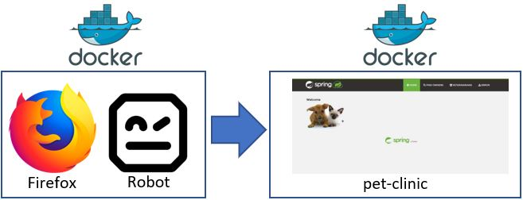

> **Tina**, to add the GUI test stage in the CI pipeline, you will need to do a pull request. Adding a stage in the pipeline needs to be peer reviewed and automatically tested by the pipeline
like any change of the code. We handle everything "as code" now!

> The [`Jenkinsfile`](https://jenkins.io/doc/book/pipeline/jenkinsfile/) is what codifies our pipeline - so this is the file we need to edit.
We add a stage which runs the automated test suite that you created. The [`stage`](https://jenkins.io/doc/book/pipeline/syntax/#stage) directive contains a sequence of [`steps`](https://jenkins.io/doc/book/pipeline/syntax/#steps).

> Right. I leverage [Docker](https://www.docker.com/) for the test suite:
> * One Docker container runs the application
> * Another Docker container runs the test suite - which uses the [robot framework](http://robotframework.org/) and the [Selenium library](https://github.com/robotframework/SeleniumLibrary).

> To combine the two, I use [`docker-compose`](https://docs.docker.com/compose/overview/). All of this will easily run on Jenkins!

> I prepared the following stage for you to include in the `Jenkinsfile`: 

<pre class="file" data-target="clipboard">
        stage("Functional GUI Tests") {
            steps {
                echo 'Invoking automated test cases in docker '
                echo 'stop the docker container'
                sh "chmod +x robot.sh"
                sh "./robot.sh stop-test dev"
                echo 'build the docker file'  
                sh "./robot.sh rebuild-test dev"
                echo 'start docker container'
                sh "./robot.sh start-test dev"
                sh "mkdir -p report"
                echo 'copy test cases report from docker container'
                sh "docker cp selenium-testsuite:home/robotframework/src/test/selenium-robot/output.xml report"
                sh "docker cp selenium-testsuite:home/robotframework/src/test/selenium-robot/log.html report"
                sh "docker cp selenium-testsuite:home/robotframework/src/test/selenium-robot/report.html report"
            }
        }

        stage('Archive GUI Test Results') {
            steps {
                echo 'Archive GUI Test Results'
               step([$class: 'RobotPublisher', disableArchiveOutput: false, logFileName: 'log.html', otherFiles: '', outputFileName: 'output.xml', outputPath: 'report/', passThreshold: 100, reportFileName: 'report.html', unstableThreshold: 0]);
            }
        }
</pre>

> Nice. So, let's add the GUI test stage in the CI pipeline. Let's go to the terminal window and edit the `Jenkinsfile`:

> * `cd pet-clinic`{{execute}}
> * `nano Jenkinsfile`{{execute}}
> * Copy the stage code provided by Tina above and paste after the `stage('Deploy') {` block, towards the very end of the `Jenkinsfile`. You should have 2 "}" after the block you are inserting
> * Exit the editor (`ctrl-X` and save: `Y` and `Enter`).

> Now, we create the pull request to modify the `Jenkinsfile`:
> * I find the user story ID in the backlog which corresponds to "Add functional testing stage in CI/CD pipeline" - [https://github.dxc.com/[your_username]/pet-clinic/issues](https://[[HOST_SUBDOMAIN]]-9876-[[KATACODA_HOST]].environments.katacoda.com/#user-story) - it will looks like this is story #3.
> * I create a feature branch: `git checkout -b us3-continuous-testing`{{execute}}
> * Check the status: `git status`{{execute}}
> * Add the `Jenkinsfile`: `git add Jenkinsfile`{{execute}}
> * Commit the changes: `git commit -m "Add functional GUI tests in the pipeline" `{{execute}}
> * Push the changes to GitHub: `git push -u origin us3-continuous-testing`{{execute}}
> * And finally go to the repository on GitHub and create a pull request: [https://github.dxc.com/[your_username]/pet-clinic/](https://[[HOST_SUBDOMAIN]]-9876-[[KATACODA_HOST]].environments.katacoda.com/#repo)
