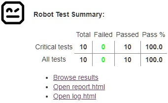
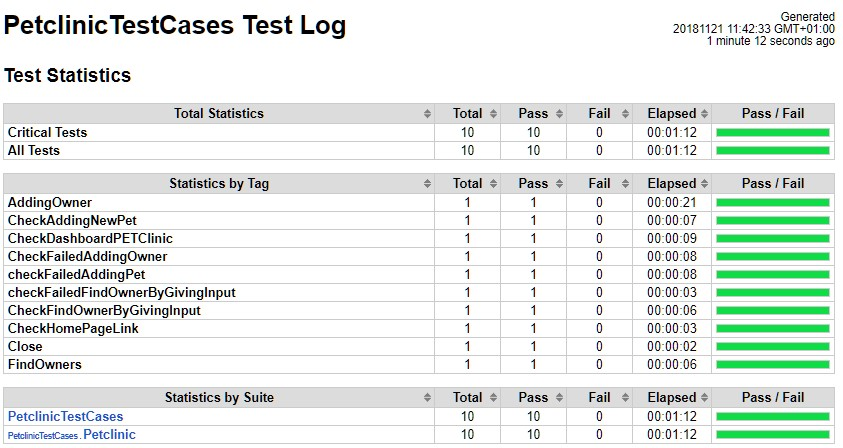

> I would like to verify if the change was successful. By creating the pull requests, a Jenkins build was automatically triggered, and I can see the progress and eventually the results directly in the context of the pull request: 
[https://github.dxc.com/[your_username]/pet-clinic/pulls](https://[[HOST_SUBDOMAIN]]-9876-[[KATACODA_HOST]].environments.katacoda.com/#pull-request).

> There are even more details available on Jenkins:
<a href="https://[[HOST_SUBDOMAIN]]-8080-[[KATACODA_HOST]].environments.katacoda.com/blue/organizations/jenkins/pet-clinic/activity/" target="jenkins">https://[[HOST_SUBDOMAIN]]-8080-[[KATACODA_HOST]].environments.katacoda.com/blue/organizations/jenkins/pet-clinic/activity/</a>

> Especially Robot summary results and logs from the Selenium framework which are archived in the Jenkins build

> Everything looks good, so **let's merge the pull request** which
adds automated testing as part of the pipeline.

---

**Note**: if you need to edit the `Jenkinsfile` again (or want to play a little longer here), you can add more commits in the pull request - before it gets merged - like so:

* Update `Jenkinsfile`: `nano Jenkinsfile`{{execute}}
* Add the Jenkinsfile to staging area: `git add Jenkinsfile`{{execute}}
* Commit the change(s) with a comment: `git commit -m "Fix typo"`{{execute}}
* Push the changes to GitHub: `git push`{{execute}}
