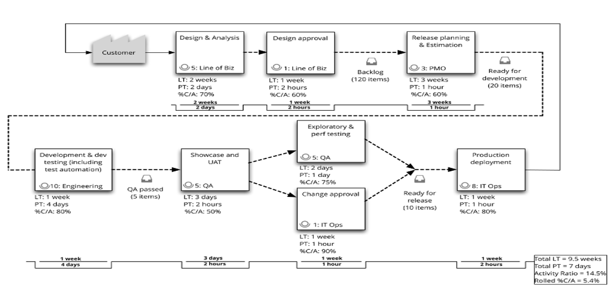

While the DevOps Kaizen module can be taken independently, it follows directly
on from the Value Stream Mapping module.

Hopefully you have followed our advice and taken the Value Stream Mapping (VSM)
module of the **Yellow Belt DevOps Dojo** and are thus helping us in the serious
business of protecting the space time continuum.

This is the VSM which the Pet Clinic team created to represent the E2E flow of
their development process:

The team have gotten sponsorship from management to improve, and are now
wondering how to leverage the VSM as the starting point.

|   |   |
|---|---|
||**Chun** DevOps coach for the DevOps Kaizen events |
||**Paulo** Product Owner who is sponsoring the DevOps Kaizen events |
||**Santhosh** Scrum Master who is facilitating the DevOps Kaizen events |
||**Brenda** Business representative in the DevOps Kaizen events |
||**Selma** Security representative in the DevOps Kaizen events |
||**Adam** IT Admin representative in the DevOps Kaizen events |
||**Dan** Developer representative in the DevOps Kaizen events |
||**Tina** Test representative in the DevOps Kaizen events |
