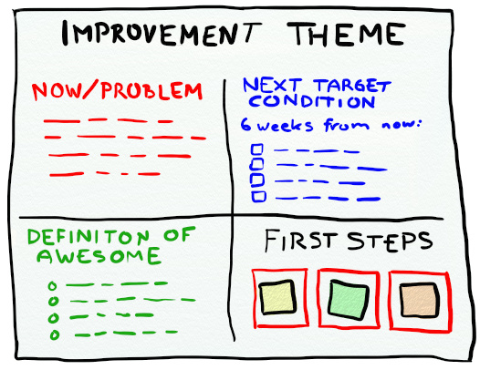

We rejoin the team after they have agreed to follow these high level steps based on industry best practices to implement their DevOps Kaizen cycle

- Appoint a Kaizen facilitator
- Ensure leadership and team are engaged
- Assemble the Kaizen team
- Set the scope and limits of the Kaizen Events
- Assess current state and define success
- Prepare and schedule the Kaizen events
- Kick off Kaizen Cycle

The team is engaged, assembled and excited to start. They are in the middle of working through the implementation plan. They have:

- Obtained leadership support
- Selected Chun as the DevOps coach.
- Appointed Santhosh as the Kaizen facilitator.
- Set the scope and limits of the Kaizen Event.
- Decided on a 6 week Kaizen event cycle with 2 week increments and aligned them with the teams current sprint cycle.
- Agreed to set time aside in the Scrum ceremonies to plan, discuss progress on and review DevOps Kaizen improvements.
- Agreed that the work to implement the desired improvements will be managed via the teams' Agile Backlog.
- Created an epic in their Agile tool to track the DevOps Kaizen user stories.
- Appointed key team members. Adam, Dan, Tina and Selma have committed 20% of their time to the DevOps Kaizen implementation.

They now need to assess current state and define success as well as to prepare, schedule and kick of the Kaizen Cycle.

Chun suggests the use of Improvement Themes to assess current state and define success

and explains that the Improvement Theme consists of five areas.

1. Improvement Theme Name
2. Now/Problem – Description of the current state
3. Definition of Awesome – The desired state 
4. Next Target Condition – X weeks from now, what will have changed?
5. First Steps – 3 slots which describe the first steps to be taken to address the delta between current and desired state

She further explains that the Improvement Theme should be a living document accessible to all stakeholders. The core Kaizen team should review the Improvement Theme once or twice per week, updating the theme based on completed and new identified actions.
