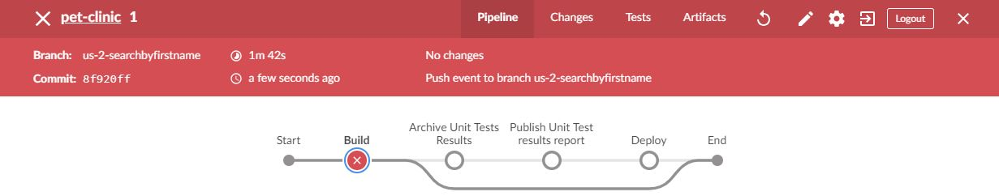

> Team, as you know, the business wants us to be able to search for pet owners not only by last name, but also by **first name**. We have a [user story](https://[[HOST_SUBDOMAIN]]-9876-[[KATACODA_HOST]].environments.katacoda.com/#user-story) for it in our backlog and we prioritized it in this current sprint. Let's go!

> Sure. Following Test Driven Development, let me first add unit tests for this user story.

# Steps

* Navigate to your copy of the Pet Clinic application on GitHub, in the unit tests file: [`/src/test/java/org/springframework/samples/petclinic/service/ClinicServiceTests.java`](https://[[HOST_SUBDOMAIN]]-9876-[[KATACODA_HOST]].environments.katacoda.com/#ClinicServiceTests).
* Click on the pencil icon in the top right corner to edit the file.
* Add the following unit test at line 87, below the `shouldFindOwnersByLastName()` block:
<pre class="file" data-target="clipboard">

    @Test
    public void shouldFindOwnersByFirstName() {
        Collection owners = this.owners.findByFirstName("Betty");
        assertThat(owners.size()).isEqualTo(1);
    }
</pre>
* Start a pull request by commiting the changes in a new branch which you will name after the user story: `us-4-searchbyfirstname`{{copy}}
* Name the pull request: `Closes #4: search by first name`{{copy}}
* The build will trigger automatically.
* Navigate to [Jenkins](https://[[HOST_SUBDOMAIN]]-8080-[[KATACODA_HOST]].environments.katacoda.com/) and verify that the build fails.

> Good, I can verify my tests are failing: this is expected as the feature to search by first name is not there yet.
> This is what I see when I open the <a href="https://[[HOST_SUBDOMAIN]]-8080-[[KATACODA_HOST]].environments.katacoda.com/blue/organizations/jenkins" target="jenkins">Blue Ocean UI</a> and click on the status icon along the left side in Jenkins:

