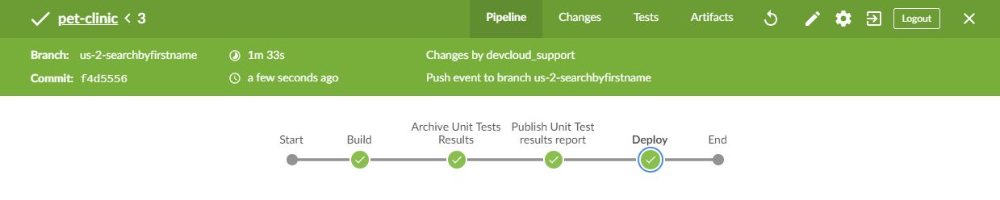

 

> OK. The build is passing now, but we are not done yet: the controller needs to be updated as well.

# Steps

* Continuing in the branch of the pull request named `us-4-searchbyfirstname`, let's edit the controller: [`/src/main/java/org/springframework/samples/petclinic/owner/OwnerController.java`](https://[[HOST_SUBDOMAIN]]-9876-[[KATACODA_HOST]].environments.katacoda.com/#ownercontroller) 
* Click on the pencil icon in the top right corner to edit the file
* Delete from line 77 to 100 and copy/paste below code: 
<pre class="file" data-target="clipboard">

    @GetMapping("/owners")
    public String processFindForm(Owner owner, BindingResult result, Map<String, Object> model) {

        // allow parameterless GET request for /owners to return all records
        if (owner.getLastName() == null) {
            owner.setLastName(""); // empty string signifies broadest possible search
        }
        
        // allow parameterless GET request for /owners to return all records
        if (owner.getFirstName() == null) {
            owner.setFirstName(""); // empty string signifies broadest possible search
        }

        // find owners by last name
        Collection<Owner> results = this.owners.findByLastName(owner.getLastName());
        if (results.isEmpty()) {
        	{
        		results = this.owners.findByFirstName(owner.getLastName());
        	}
        }
        
        if (results.isEmpty()) {
            // no owners found
            result.rejectValue("lastName", "notFound", "not found");
            return "owners/findOwners";
        } else if (results.size() == 1) {
            // 1 owner found
            owner = results.iterator().next();
            return "redirect:/owners/" + owner.getId();
        } else {
            // multiple owners found
            model.put("selections", results);
            return "owners/ownersList";
        }
    }
    
</pre>

* Choose commit in the same branch (`us-4-searchbyfirstname`), so that edits continue to happen in the context of the same pull request
* Navigate to <a href="https://[[HOST_SUBDOMAIN]]-8080-[[KATACODA_HOST]].environments.katacoda.com/blue/organizations/jenkins/pet-clinic/pr" target="jenkins">Jenkins</a> and verify that the build stage works by clicking on the status icon:

