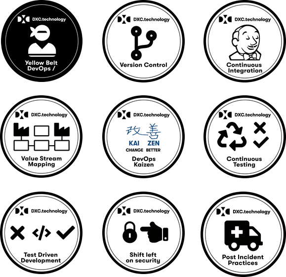

## Welcome!

Welcome to the **Yellow Belt DevOps Dojo** Katacoda course.

## The DevOps Dojo Yellow Belt - First Stripe

This course is the first stripe of your DevOps Dojo Yellow Belt.

It is made up of 9 content modules and an assessment.

The content modules are:

* Leading Change
* Version Control
* Continuous Integration
* Value Stream Mapping
* DevOps Kaizen
* Continuous Testing
* Test Driven Development
* Shift Left On Security
* Post Incident Practices

Each content module awards a badge. Once you complete all content modules and the assessment, you will get the
first stripe on your Yellow Belt.

## Katacoda environment

The modules make use of Katacoda environments. Those are ephemeral environments
which are created just for you, on the fly. They will time out after one hour.
The good news is that you can explore around and get out of the script: it is
your own environment.

So, go grab a cup of your favorite caffeinated beverage, close your email, put
your phone on plane mode, and let's get started!

## Welcome module

In this Welcome module lab, we will get you started and setup a dedicated
environment for you, to allow you complete the labs for the other modules in the
**Yellow Belt DevOps Dojo** at your own pace.

First, to begin let us introduce you to the story of a business formed by the
CEO Charlie, a DevOps team, an application and its delivery chain (continuous
delivery pipeline).

Once upon a time, not so long ago in a galaxy not so far away...

